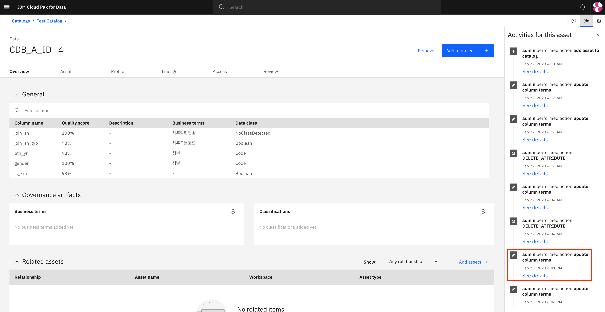

# 비지니스 용어 일괄 매핑 (Watson Knowledge Catalog)

**배경**

초기셋업으로써 Cloud Pak for Data에 미리 만들어둔 거버넌스 체계를 입힐 때, Metadata Enrichment를 통해 비지니스 용어들을 모든 데이터 에셋에 붙이는 작업은 반복적이고 시간이 많이 든다. 이러한 한계점을 극복하기 위해 [Watson Data API](https://cloud.ibm.com/apidocs/watson-data-api-cpd)를 이용하여 카탈로그의 에셋들에 비지니스 용어를 붙이는 커스텀 코드를 만들었다. 


**데모**

* JSON 파일 기반 비지니스 용어 매핑 - [notebook](./assets/data_asset/test_class_TypeA.ipynb)

* 키보드 인풋 기반 비지니스 용어 매핑 - [notebook](./assets/data_asset/test_class_TypeB.ipynb)

* 함수별 테스트 노트북 - [notebook](./assets/data_asset/map_bizterm.ipynb)

* Watson Data API 기반 클래스 - [code](./assets/data_asset/wkcapi_v1.py)
 

**코드 설명**

용어 매핑을 위해 다음의 절차들이 필요하다.

1. 프로젝트의 파일들을 런타임에 다운로드

    ```Python
    from ibm_watson_studio_lib import access_project_or_space
    wslib = access_project_or_space()
    wslib.download_file('<file_name>')
    ```

2. 클래스 인스턴스 만들어 username/password 기반 토큰 발행

    A) Json 파일로 username/password를 받아 사용할 경우 

    ```Python
    from wkcapi_v1 import MapTermsJSON
    wkc = MapTermsJSON(
        cpd_cluster_host='<cpd_cluster_host>',
        info_json='<info_json_file>'
    )
    ```

    B) 키보드 인풋으로 username/password를 받을 경우

    ```Python
    from wkcapi_v1 import MapTermsInput
    wkc = MapTermsInput(
        cpd_cluster_host = '<cpd_cluster_host>',
    )
    ```

3. 비지니스 용어 일괄 매핑
    ```Python
    wkc.map_bizterm_allatonce('<bizterm-glossary_csv_file>')
    ```

4. 비지니스 용어 매핑 확인
    ```Python
    wkc.view_attribute('<asset_name>','<catalog_name>')
    ```

5. 비지니스 용어 매핑 삭제
    ```Python
    wkc.delete_attribute('<asset_name>','<catalog_name>')
    ```

**데모시 주의사항**

1. 실행 환경에 따라 api 콜에 타임아웃이 발생하는 경우가 있다. 타임아웃 발생시 몇번 더 시도하고 계속 실패 시 코드내 타임아웃 시간을 늘린다. 

2. 카탈로그의 권한이 없을 경우 권한이 없다고 나오지 않고 카탈로그를 찾지 못한다고 나온다.

3. 에셋에 해당 컬럼이 없는데 `<bizterm-glossary_csv_file>`에서 해당 컬럼에 비지니스 용어를 할당하도록 되어있다면 에셋의 메타데이터에 해당 정보가 들어가도록 되어있다. 큰 문제는 없으나 차후 업데이트 예정.

4. 용어 할당 작업 중에 거버넌스 체계에 새로 추가하거나 업데이트 해서는 안된다.

5. API 콜 시 중복 작업을 줄이기 위해서 아이템들의 id를 저장하도록 설계되어 있다. 따라서 노트북의 커널을 리셋하지 않으면 비지니스 용어 매핑 재실행 시 이미 불렀던 api콜 들을 다시 안부르게 된다. 한편으로는 이 작업이 진행되는 중에 거버넌스 체계에 새로운 것을 생성하거나 지우거나 변형해서는 안된다.

6. API 콜 관련 예외 상황이 벌어지는 경우 [error.log](./assets/data_asset/error.log)에 로그를 남기도록 하였다. 용어 매핑 완료 실패시 이 파일을 보고 문제를 파악할 수 있다. 로그 파일의 경우 프로젝트 내 파일로는 안보이고 노트북에서 터미널을 열어 `cat error.log`통해 확인할 수 있다.
    
**결과**


  

  

  

    
**성능**

IBM Techzone에서 IBM RedHat Openshift Kubernetes Service(ROKS)를 worker node 5개에 노드별 32vCPU x 128GB RAM w/ 100GB secondary storage + NFS 4TB를 리저브하여 설치 및 테스트하였다. 대략 1000개의 비지니스 텀에 대해 테스트하였고 데이터 에셋 별 0.2 ~ 1초 가량의 시간이 걸리는 것을 확인하였다. 20개의 카탈로그에 카탈로그 별 50개의 에셋이 있다 가정할 때 전체 비지니스 용어 불이는데 1000초(16.6분) 이하의 시간이 걸릴 것으로 예상된다.
    
    
  
**한계점**
1. 같은 카탈로그내 동일한 이름의 에셋을 구별할 수 없다. 동일한 이름의 에셋을 사용하지 않도록 권한다.

2. 하위 카테고리 구조가 일치하는 경우 구분하기 힘들게 되어있다. 예를 들면, ParentA >> SubCategory >> SubSubCategory 와 ParentB >> SubCategory >> SubSubCategory 들이 있는 경우 SubSubCategory들에 대해 구별하지 못하도록 되어있다. 이런 구조의 카테리고를 사용하지 말 것을 권하며 추후 업데이트를 통해 해결할 예정이다.
    

**참고**

다음은 [source code](./assets/data_asset/wkcapi_v1.py)에 구현되어 있는 함수들이다. 

1. get_catalog_id(catalog_name) : 카탈로그 이름의 id 리턴

2. get_category_id(category_path) : 카테고리 패스의 id 리턴 (예. Parent Category >> Sub Category A)

3. get_asset_id(asset_name, catalog_name) : 카탈로그 내 에셋의 id 리턴

4. view_asset_info(asset_name, catalog_name) : 카탈로그 내 에셋의 메타데이터 프린트

5. create_attribute(asset_name, catalog_name) : 카탈로그 내 에셋에 column_info 어트리뷰트 생성

6. view_attribute(asset_name, catalog_name) : 카탈로그내 에셋의 column_info 관련 메타데이터 프린트

7. delete_attribute(asset_name, catalog_name): 카탈로그 내 에셋의 column_info 어트리뷰트 삭제

8. update_attribute(asset_name, catalog_name,column_name,bizterm_name, category_path) : 카탈로그내 에셋의 column_info 어트리뷰트에 해당 컬럼에 대한 비지니스 용어 정보 업데이트

9. get_bizterm_id(bizterm_name, category_path) : 카테고리 패스 내의 비지니스 용어의 id 리턴

10. map_bizterm_allatonce(map_bizterm_csv): map_bizterm_csv로부터 에셋별 비지니스 용어를 모아 column_info 어트리뷰트를 생성